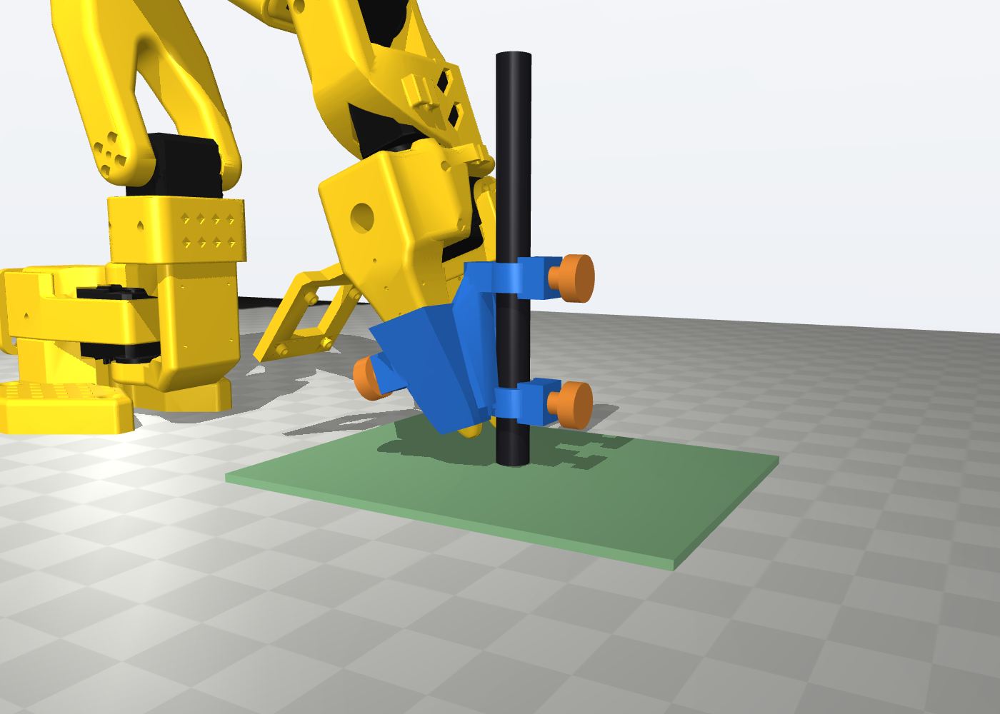
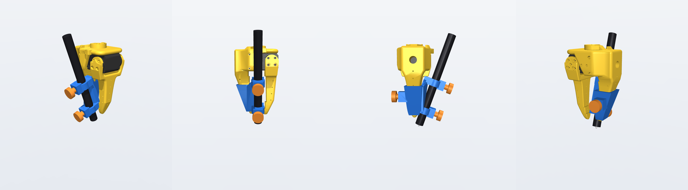
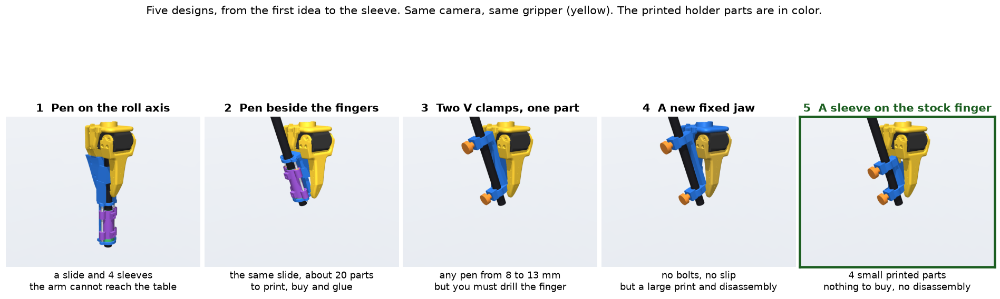
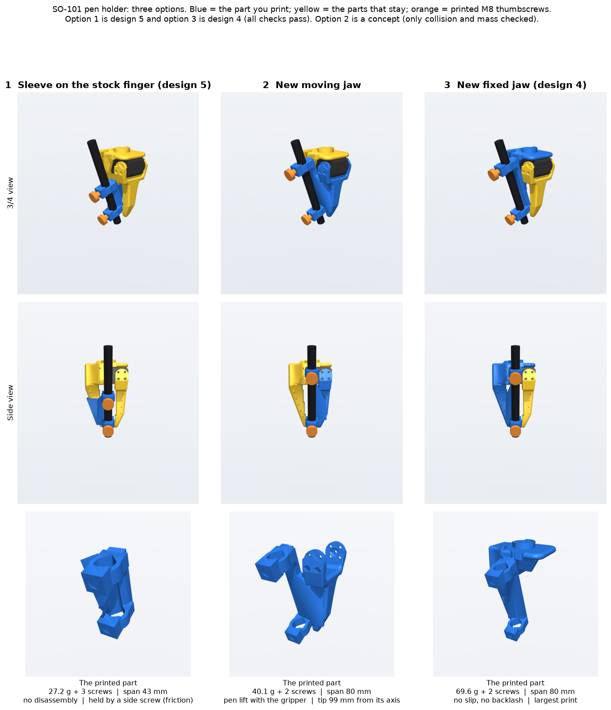
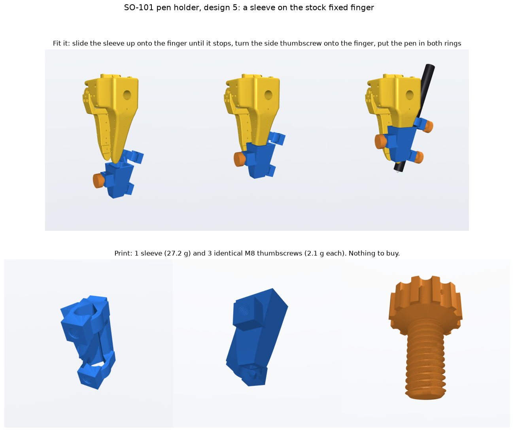
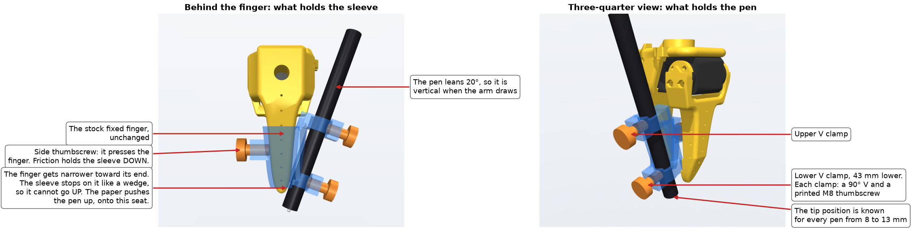
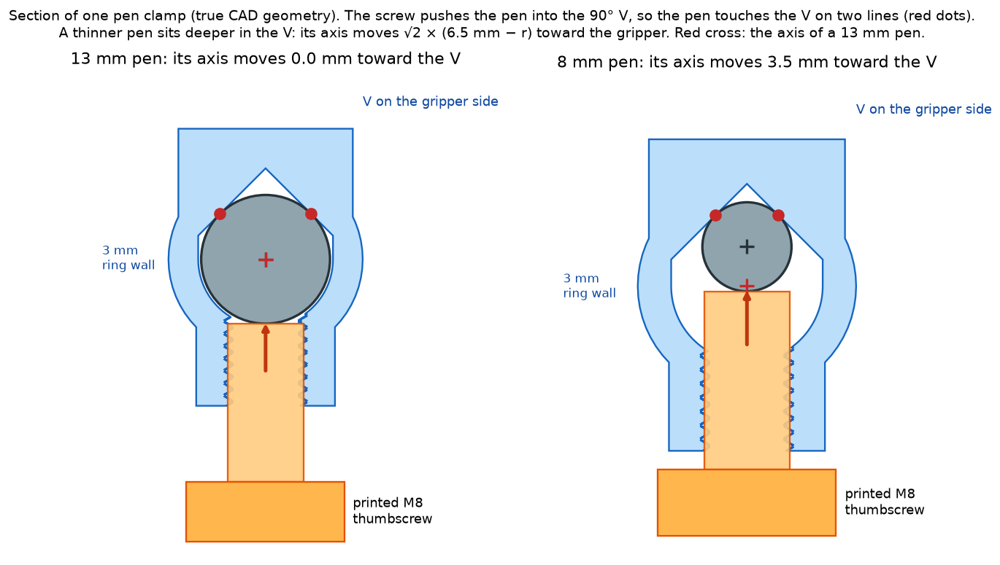
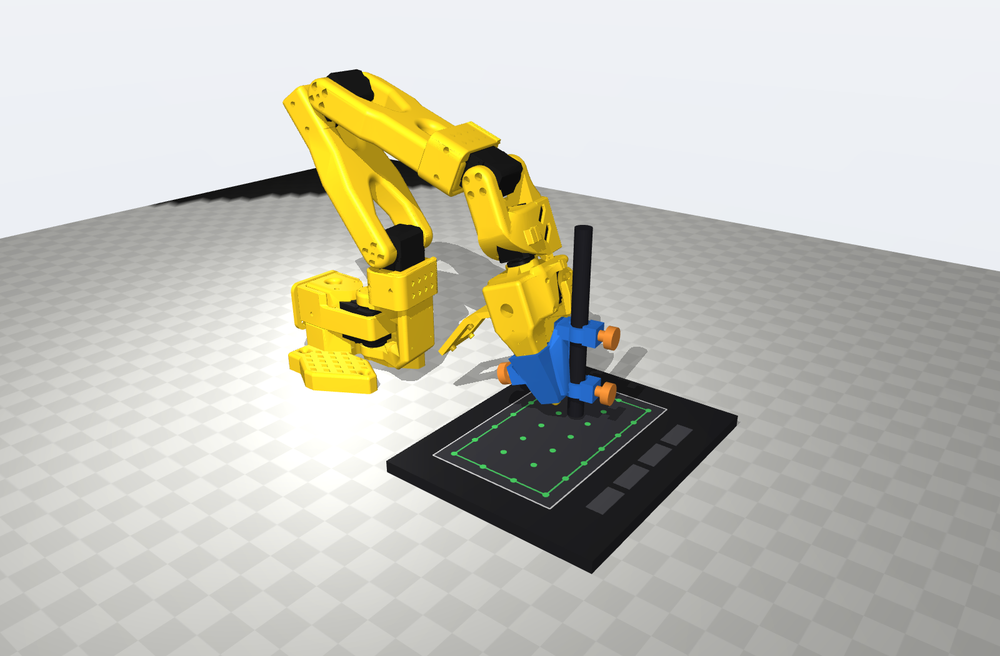

# SO-101 pen holder

This is a printed sleeve that holds a pen on the stock gripper of the SO-101 robot arm. You print 4 small parts. You do not buy parts, and you do not take the arm apart.



> [!NOTE]
> **Status: design only.** The parts pass every collision check in CAD. Nobody has printed or tested them yet. Every number on this page is a design value, not a measurement. If you print the holder, you can report the result in an issue.

| | |
|---|---|
| Printed parts | 1 sleeve (27 g) and 3 identical M8 thumbscrews (2 g each) |
| Parts to buy | none |
| Pens | any round pen from 8 to 13 mm, for example a Wacom Pen 4K, a BIC 4-Colour or a Pilot V5 |
| Tablet | the Wacom Intuos S (CTL-4100), ±0.25 mm. See [Measure the tip with a Wacom tablet](#measure-the-tip-with-a-wacom-tablet). |
| Changes to the arm | none. The sleeve slides onto the fixed finger. |
| Fits | the stock SO-101 follower gripper (`Wrist_Roll_Follower_SO101`) |
| License | Apache-2.0 |

The holder on the stock gripper, from four sides. The blue sleeve is the printed part, and the orange parts are the printed thumbscrews:



## Why a pen on a robot arm

A drawing is a simple test of how accurately an arm follows a path. When the arm leaves the path, the line on the paper shows it. You can see the error without a log file or a plot, and you can compare two controllers on the same sheet.

I use this test in my SO-101 control project. In a typical drawing pose, an error of 1 mrad on every joint moves the pen tip by about 0.3 mm on the paper. With the joint errors of my best controller, I expect a drawing error of about 1.2 mm RMS.

The test works only if the holder adds no error of its own. My first pen was taped into the gripper. It had two problems:

- **The pen moved in the tape.** When the paper pulled on the tip, the pen moved, and that movement looked like an arm error.
- **The tip position was not known.** My best fit of the tip position had a residual of 3 mm. That is more than the error that I want to see.

I searched GitHub, the SO-ARM100 repository, Printables, Thingiverse, MakerWorld, Cults3D and the LeRobot forum. I found grippers and camera mounts, but no pen holder for the SO-100 or the SO-101. So I designed one.

Ink shows the shape of an error, but it gives no numbers and no times. To measure the tip, I also bought a Wacom drawing tablet. The holder takes its pen. The section [Measure the tip with a Wacom tablet](#measure-the-tip-with-a-wacom-tablet) explains why.

The holder has five goals:

| Goal | Why |
|---|---|
| No play between the pen and the arm | The paper drag must not move the pen in the holder. |
| A known tip position | The arm model must know where the tip is. A guess adds an error to every point. |
| Any common pen | You can use the pen that you have, and a Wacom pen on a drawing tablet. |
| Nothing to buy, no change to the arm | Anybody with an SO-101 can try it in an afternoon. |
| A small print | A short print time and a small risk of a failed print. |

## Why this design

I made five designs. Each design fixed a problem of the one before it. The image shows all five with the same camera.



1. **The pen on the roll axis.** The pen went down through the gripper, on a slide that let it rest on the paper by its own weight. On the full arm model, the arm could not reach a table at the level of its base.
2. **The pen beside the fingers.** I compared seven ways to attach the pen. The best layout puts the pen beside the fingers and leans it 20° out of the open side of the jaws. It reaches the most paper, and the tip stays 6 mm from the roll axis. But the slide needed about 20 parts: printed parts, steel shafts, bronze bushings and glue.
3. **Two V clamps on one part.** I removed the slide. A soft pad under the paper does its job. Two V clamps hold the pen at two points far apart, so the pen cannot tilt. One clamp design fits every pen from 8 to 13 mm. But to hold the part on the finger, you had to drill two holes in the finger for metal bolts.
4. **A new fixed jaw.** I joined the clamps to a copy of the official fixed jaw. Nothing can slip, but it is a large print, and you must take the gripper apart to change the jaw.
5. **A sleeve on the stock finger.** The clamps sit on a small sleeve that slides onto the finger. This is the design in this repository.

The last choice was between three ways to attach the same clamps:



| | Sleeve on the finger (this design) | New moving jaw | New fixed jaw |
|---|---|---|---|
| Printed plastic | 34 g | 44 g | 74 g |
| Take the gripper apart | no | the moving jaw | the full gripper |
| Hold on the arm | wedge seat and friction | jaw screws | jaw screws |
| Play at the tip | none in the clamps | the backlash of the gripper motor, unless the jaw presses on a stop | none |
| Distance between the clamps | 43 mm | 80 mm | 80 mm |

I chose the sleeve for three reasons:

- **Anybody can try it.** You add one module to an arm that you already have. You do not open the gripper, and you can remove the sleeve in a minute.
- **It is the smallest print.** It uses less than half the plastic of a new fixed jaw.
- **The main load makes the hold tighter.** When the pen touches the paper, the paper pushes the sleeve up onto its seat on the finger.

The cost of the sleeve is a shorter distance between the clamps (43 mm), and a hold in the down direction that uses friction only. The [Limits](#limits) section gives the details.

## What you need

- An FDM 3D printer and about 34 g of filament. PETG is the best choice, because it creeps less than PLA under the screw force. PLA also works.
- A soft pad, 2 to 5 mm thick, to put under the paper. For example, use a mouse pad, a felt sheet or thin foam. The pen is fixed in the holder, so the pad takes up small errors in the height of the arm. On a Wacom tablet, do not use the pad.
- A stock SO-101 follower arm. The optional compliant gripper has a different finger, and the sleeve does not fit it.

## Print the parts

The files are in [`print/`](print/):

| File | Quantity | Mass | Purpose |
|---|---|---|---|
| [`thread_coupon.stl`](print/thread_coupon.stl) | 1 | 2 g | A short piece of the M8 thread, to test the screw fit on your printer |
| [`thumbscrew.stl`](print/thumbscrew.stl) | 3 | 2 g each | Two screws press the pen into the clamps. One screw presses the finger. |
| [`sleeve.stl`](print/sleeve.stl) | 1 | 27 g | The sleeve with the two pen clamps |

The masses use 0.2 mm layers, 4 walls (1.6 mm) and 40 % infill. I did not test a print orientation for the sleeve. It probably needs supports under the clamp rings.

1. Print `thread_coupon.stl` and one `thumbscrew.stl`. Print the screw with its head down.
2. Turn the screw into the coupon by hand.
3. If the screw is too tight or too loose, change `FIT_THREAD` in [`cad/build.py`](cad/build.py). Then [rebuild the parts](#rebuild-the-parts) and print the coupon again.
4. Print `sleeve.stl` and two more thumbscrews.

## Fit the holder



1. Open the gripper fully.
2. Slide the sleeve up onto the end of the fixed finger until it stops. The two pen clamps go on the open side of the jaws.
3. Turn the side thumbscrew until it is tight on the finger.
4. Push the pen through both clamp rings.
5. Set the pen tip 21 mm below the bottom face of the lower ring, measured along the pen. That puts the tip at the design position for every pen.
6. Turn each pen thumbscrew until it touches the pen. Then turn it a quarter turn more.
7. Put the soft pad under the paper.

> [!CAUTION]
> Do not command the gripper to close fully while the sleeve is on the finger. The moving jaw touches the lower clamp ring at 0.015 rad from closed. If the motor pushes harder, it presses on the ring.

## How the holder works



The sleeve holds on the finger in three directions:

- **Up:** the finger gets narrower toward its end in both directions. The pocket of the sleeve has the shape of the finger, so the sleeve stops on it like a wedge. The paper pushes the pen up, which pushes the sleeve harder onto this seat.
- **Down:** the side thumbscrew presses one side of the finger and pushes the other side against the inner wall of the sleeve. Friction on both sides holds the sleeve. A hand-tight printed M8 screw probably presses with 50 to 100 N. With a friction coefficient of about 0.3 on two faces, the hold is about 30 to 60 N. The sleeve, the screws and a pen weigh about 0.45 N. These are estimates, not measurements.
- **Sideways:** the pocket fits the finger with 0.15 mm of clearance. The side screw removes the clearance in its direction. The wedge seat removes it in the other directions when the paper pushes up.

The pen is held by two clamps 43 mm apart. Each clamp is a ring with a 90° V on the gripper side and a printed M8 thumbscrew on the other side. The screw pushes the pen into the V. A round pen in a V touches it on two lines, so it can sit in only one position. There is no play to remove.

## Pens and the tip position



A thinner pen sits deeper in the V. Its axis moves toward the gripper by:

$$
\text{shift} = \sqrt{2}\,(6.5\ \text{mm} - r)
$$

where r is the radius of the pen. So the tip position is known for every round pen. The table gives the tip position in the frame of the `gripper` body of the SO-101 MuJoCo model ([MuJoCo Menagerie](https://github.com/google-deepmind/mujoco_menagerie/tree/main/robotstudio_so101)). In that frame, z is the wrist_roll axis and the fingers point to −z.

| Pen | Diameter | Axis shift | Tip position (x, y, z), mm | Tip off the roll axis |
|---|---|---|---|---|
| 13 mm pen | 13.0 mm | 0.00 mm | (0, −6.00, −120.00) | 6.00 mm |
| Wacom Pen 4K (LP1100K) | 12.0 mm | 0.71 mm | (0, −5.34, −119.76) | 5.34 mm |
| BIC 4-Colour | 11.6 mm | 0.99 mm | (0, −5.07, −119.66) | 5.07 mm |
| Pilot V5 | 10.6 mm | 1.70 mm | (0, −4.41, −119.42) | 4.41 mm |
| 10 mm pen | 10.0 mm | 2.12 mm | (0, −4.01, −119.27) | 4.01 mm |
| 8 mm pen | 8.0 mm | 3.54 mm | (0, −2.68, −118.79) | 2.68 mm |

For another pen, measure its diameter at the two clamps with calipers. Then use these values:

- The tip of a 13 mm pen is at (0, −6, −120).
- The axis shift is along (0, cos 20°, sin 20°).
- The pen axis, from the tip up, is (0, −sin 20°, cos 20°).

If the pen is tapered, the two clamps see two diameters, and the pen tilts a little. Measure both diameters.

## Measure the tip with a Wacom tablet

I bought a Wacom Intuos S drawing tablet (model CTL-4100, wired) on 5 October 2026. A drawing tablet senses the position of its own pen, without contact. The holder takes this pen, the Wacom Pen 4K (LP-1100K).



### Why I bought this tablet

I bought it for four reasons:

- **It measures the tip, not the joints.** The joint encoders measure the joint angles. The arm model then calculates the tip, so the encoders cannot see bending, gear play or errors in the model. The tablet measures the tip itself.
- **It records the time.** The tablet sends the tip position 133 times per second. That is more than 2 times the 60 Hz control rate of the arm. So I can align the tablet data with the arm log and see when the arm is late, not only where it goes.
- **Its tolerance is small compared with the error.** Wacom gives ±0.25 mm. I expect a drawing error of about 1.2 mm RMS, and 1 mrad on every joint moves the tip by about 0.3 mm.
- **It is cheap, and it adds nothing to the arm.** It costs about 40 USD. The pen has no battery and no cable, so no wire pulls on the arm.

### The tablet values

The table gives the values from the [Wacom Intuos technical specifications](https://www.wacom.com/en-us/products/pen-tablets/wacom-intuos), read on 7 October 2026:

| Property | Value |
|---|---|
| Accuracy | ±0.25 mm. Wacom calls it the "digital tolerance in accuracy". |
| Resolution | 2540 lines per inch, which is 0.01 mm |
| Report rate | 133 per second |
| Reading height | 7 mm above the surface |
| Active area | 152 × 95 mm |
| Tablet size | 200 × 160 × 8.8 mm |
| Pressure levels | 4096 |
| Pen | Wacom Pen 4K (LP-1100K), 11.2 g, no battery, no ink |

Wacom does not say where on the tablet or at which pen angle the ±0.25 mm applies. So I use two rules:

- **Keep the drawing 10 mm inside the active area.** Wacom gives no value for the edges, and other makers publish a larger error at the edges. The usable area is then 132 × 75 mm.
- **Keep the pen vertical.** The coil of the pen is above the nib, so a tilted pen moves the reading. The Intuos S does not measure the tilt, so it cannot correct it. The holder keeps the pen vertical in the drawing pose.

### Put the tablet under the arm

1. Put the center of the active area 181 mm in front of the `shoulder_pan` axis, with the long side across the arm. That is about 155 mm in front of the front edge of the base.
2. Tape or clamp the tablet to the table. Do not put the soft pad under the tablet, because the tablet must not move.
3. In your arm model, set the drawing surface 8.8 mm above the table.
4. Put the Pen 4K in the holder as in [Fit the holder](#fit-the-holder). Its tip position is in the [pen table](#pens-and-the-tip-position).

Without the soft pad, a height error of the arm pushes the pen into the tablet or lifts it. You can use the tablet in two ways:

- **Hover:** command the tip 2 to 3 mm above the surface. The tablet reads the pen up to 7 mm away, and there is no drag. Wacom does not publish the accuracy in hover.
- **Contact:** let the tip touch the surface. The tablet also records the pen pressure, so you know when the pen touches.

In the arm model, the arm reaches the full usable area. With the pen vertical, an inverse kinematics solution exists at all 28 points of a 4 × 7 grid, at contact and at 3 mm hover. The lowest point of the arm stays 20 mm above the tablet. These values come from the [MuJoCo Menagerie SO-101 model](https://github.com/google-deepmind/mujoco_menagerie/tree/main/robotstudio_so101), not from the real arm. The results are in [`results/tablet_reach.json`](results/tablet_reach.json).

I did not test the tablet with the arm yet. The first tests are the noise of a still pen with the servos off and on, the reading at hover heights from 0 to 7 mm, and the effect of the servo magnets near the pen.

## What the CAD checks

[`cad/build.py`](cad/build.py) builds the parts from parameters and checks them against the stock gripper meshes. It writes the results to [`results/checks.json`](results/checks.json). These checks pass:

- The sleeve does not touch the fixed finger, the gripper motor or the moving jaw anywhere from 0.3 to 1.4 rad.
- The sleeve slides 60 mm up onto the finger with no contact, with the gripper open.
- The moving jaw stops on the lower clamp ring at 0.015 rad from closed.
- Six pens from 8 to 13 mm do not touch the sleeve or the gripper.
- The three screws mesh with their threads, and their heads stay clear of their bosses.
- The lowest point of the sleeve is 14 mm above the tip, so only the tip touches the paper.

The clamp rings and the side walls of the sleeve are 2.6 to 3 mm thick. The front skin of the sleeve, between the finger and the pen, is 0.85 mm thick. It must be thin, because the pen passes close to the finger, and it carries almost no load.

## Limits

- **Not printed yet.** The fit of the pocket comes from the official CAD of the finger. If your printed finger is a little larger or smaller, the fit changes. Test the sleeve on the finger before you put the pen in.
- **Friction in the down direction.** Nothing locks the sleeve positively in the down direction. A hard knock can move it, and plastic creeps with time. Tighten the side screw before each session.
- **A short clamp span.** The finger is short, so the clamps are only 43 mm apart. The V clamps have no play, but I did not calculate how much the sleeve bends under the paper drag.
- **The printed threads.** Plastic threads wear after many pen changes. If a thread wears out, print a new screw. If the hole wears out, print a new sleeve.

## Rebuild the parts

I tested the build with Python 3.12 on macOS.

```bash
python3 -m venv .venv
```

```bash
.venv/bin/pip install -r cad/requirements.txt
```

```bash
.venv/bin/python cad/build.py
```

The build takes about one minute. It writes `print/*.stl` and `results/checks.json`, and it exits with code 1 if a check fails. All the dimensions are constants at the top of [`cad/build.py`](cad/build.py). To draw the clamp section again, install `matplotlib` and run `cad/figure_clamp_section.py`.

## The full story

The article [A pen holder that shows the arm's error, not its own](https://hadrien-cornier.github.io/robotics/so101-pen-holder/) explains every design, the layout comparison, and the numbers behind each choice. It is part 5 of the series *From policy to action: the last mile of robotics control*.

## License and credits

The design is licensed under the [Apache License 2.0](LICENSE).

The gripper meshes in [`cad/meshes/`](cad/meshes/) are copied without change from [MuJoCo Menagerie](https://github.com/google-deepmind/mujoco_menagerie) (Apache-2.0). They come from the [SO-ARM100](https://github.com/TheRobotStudio/SO-ARM100) CAD by TheRobotStudio (Apache-2.0). The [`NOTICE`](NOTICE) file and [`cad/meshes/PROVENANCE.md`](cad/meshes/PROVENANCE.md) give the details.

The SO-101 is a design of TheRobotStudio and Hugging Face. This project is not affiliated with them.

Author: [Hadrien Cornier](https://github.com/Hadrien-Cornier).
